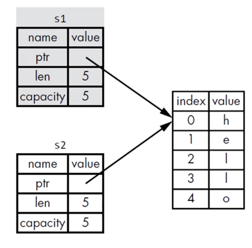
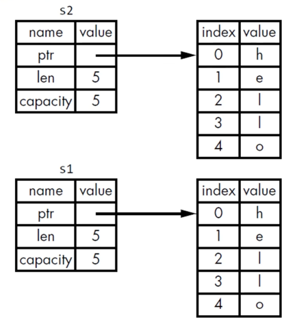
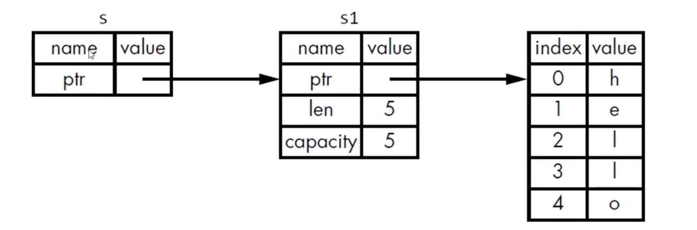
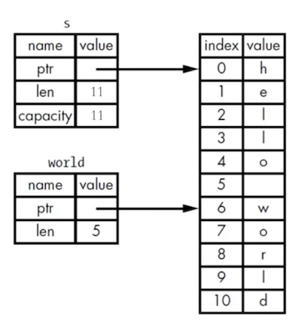

### 一：基础概念

#### 所有权规则

- 每个值都有一个变量，这个变量是该值的所有者
- 每个值同时只能有一个所有者
- 当所有者超出作用域时，该值将被删除

#### rust 内存释放

在变量离开作用域时，自动调用drop函数来释放资源并进行清理工作

#### String类型

- 字符串字面值: 在编译时就知道它的内容，其文本内容直接被硬编码到最终的可执行文件里
    - 值不可变，因此速度快、高效
- String类型，为了支持可变性，需要在heap上分配内存来保存编译时未知的文本内容
    - 一个String包含3个部分：1、指向存放字符串内容的内存的指针 2、长度 3、容量
    - String类型数据的描述信息放在 stack 上
    - 存放字符串内容的部分在 heap 上
    - 操作系统必须在运行时请求内存，通过调用 String::from 来实现

#### 移动（Move）

```
let str1 = String::from("hello");
let str2 = str1;
```

- 为了保证内存安全，避免二次释放(double free):
    - 当把str1赋给str2时，仅会复制stack上的数据描述信息，不会复制指针所指向的heap上的内存。
    - 当str1离开作用域的时候，会让str1失效，也不需要释放任何资源。
    - 在str2离开作用域的时候，才会进行资源释放。



> [!Tip]
> 也可以将以上内容理解为浅拷贝(shallow copy)，但rust同时还会让str1失效。如果需要实现深拷贝(deep copy)，可使用clone方法



#### Stack上的数据: 复制

- Copy trait, 可以用于像整数一样的简单值，完全存放在stack上面的类型
- 如果一个类型实现了Copy这个trait，那么旧的变量在赋值后不需要 clone 也仍然可用
- 如果一个类型或者该类型的一部分实现了Drop trait，那么Rust不允许让它再实现Copy trait

#### 函数的参数与返回值

- 在语义上，将值传递给函数和把值赋给变量是类型的，将值传递给函数将会发生移动或复制。
- 函数在返回值的过程中同样也会发生所有权的转移

> [!IMPORTANT]
>
> 一个变量的所有权总是遵循同样的模式：
> - 把一个值赋给其它变量时就会发生移动
> - 当一个包含heap数据的变量离开作用域时，它的值就会被drop函数清理，除非数据的所有权移动到另一个变量上了

#### 引用与借用

- 参数的类型是 &String 而不是String
- & 符号就表示引用，允许你引用某些值而不取得其所有权
- 我们把引用作为函数参数这个行为叫做借用
- 和变量一样，引用默认也是不可变的



#### 可变引用

- 引用使用 &mut 可以成为可变引用
- 在特定作用域内，对某一块数据，只能有一个可变的引用
- 可以通过创建新的作用域，来允许非同时的创建多个可变引用

#### 引用的规则

- 在任何给定的时刻，只能满足下列条件之一：
    - 一个可变的引用
    - 任意数量的不可变引用
- 引用必须一直有效，否则会出现悬空指针，编译会报错

#### 切片(slice)

- slice 是一种不持有所有权的数据类型
- 字符串切片是指向字符串中一部分内容的引用
- 字符串字面值被直接存储在二进制程序中，let s = "Hello,World".变量s的数据类型就是字符串切片(&str)，它是一个指向二进制程序特定位置的切片。
- 切片的索引遵循 左闭右开 原则
- 定义函数时使用字符串切片来代替字符串引用会使我们的API更加通用，且不会损失任何功能。



> [!Tip]
> 在rust中，字符串的底层表示是 UTF-8 编码的字节序列，字符（char）是一个 4 字节的 Unicode 标量值，
> 每个 Unicode 字符可以占用 1 到 4 个字节，如：英文字符占 1 字节，中文字符占 3 字节
> 而 Rust 的字符串切片（&str）要求始终切割在字符的有效边界上。
> 如果尝试从一个 多字节字符 的中间进行切片，程序会触发Panic。

#### 结构体(struct)

- 使用struct关键字，并为整个struct命名
- 在花括号内，为所有字段(Field)定义名称和类型
- 每个字段定义均需以逗号结束
- 实例化struct，需要为每个字段指定具体值，无需按声明的顺序进行指定
- 一旦struct的实例是 mut 可变的，那么实例中所有的字段都是可变的
- 当字段名与字段值对应变量名相同时，可以使用字段初始化简写
- 当你想基于某个struct实例A来创建一个新实例B的时候，可以在B中使用struct更新语法（..A）
- Tuple struct 整体存在命名，但里面的元素没有名
- 可以定义没有任何字段的struct，叫做 Unit-Like struct.

```
// struct
struct User {
  name: String,
  age: u64,
  active: bool,
}

let user1 = User {
  name: String::from("hello"),
  age: 100,
  active: true,
}

let user2 = User {
  name: String::from("world"),
  ..user1
}

// Tuple struct
struct Color(i32,i32,i32);
let black = Color(0,0,0);
```

#### struct数据的所有权

```rust
struct User {
    name: String,
    age: u64,
    active: bool,
}
```

- 以上结构体的字段使用了String而不是&str:
    - 该struct实例拥有其所有的数据
    - 只要该struct实例是有效的，那么里面的字段数据也是有效的
- struct里也可以存放引用，但需要使用生命周期：
    - 生命周期保证只要struct实例是有效的，那么里面的引用也是有效的
    - 如果struct里面存储引用，而不使用生命周期，就会报错

#### struct的方法

- 方法和函数类型：fn关键字、名称、参数、返回值
- 方法与函数不同之处：
    - 方法是在struct(或者enum、trait对象)的上下文中定义
    - 第一个参数是self，表示方法被调用的struct实例
- 方法在 impl 块里定义
- 方法的第一个参数可以是&self，也可以获得其 所有权 或 可变借用
- 在调用方法时，rust会自动引用或解引用

#### 关联函数

- 在 impl 块里面不把self作为第一个参数定义的这类函数，就叫关联函数
- 关联函数通常用于构造器
- 关联函数使用 :: 符号调用

#### 枚举

- 使用 enum + 名称 + {} 定义
- 可将数据附加到枚举的变体中，每个变体可以拥有不同的类型以及关联的数据量

```rust
enum IpAddr {
    V4(u8, u8, u8, u8),
    V5(String),
}
```
```
// 枚举理解
msg = Message::Write("hello")
      |         |      |
      |         |      └── 关联数据
      |         └── 变体标识符
      └── 枚举类型
```

> [!IMPORTANT]
> 1. 模式匹配是获取枚举值的主要方式
>    - 使用 match 表达式
>    - 使用 if let 语法（适用于只关心一个变体的情况）
> 2. 每个变体可以包含不同类型和数量的数据
>    - 单元变体：无数据
>    - 结构体变体：命名字段
>    - 元组变体：匿名字段
> 3. 枚举值的所有权
>    - 当枚举包含数据（如 String）时，需要考虑所有权规则
>    - 在 match 中使用引用可以避免移动所有权

#### match
```
// 匹配守卫语法
n if condition => expression
|  |           |
|  |           └── 匹配成功时执行的代码
|  └── 条件表达式
└── 绑定变量
```

> [!IMPORTANT] 注意事项
> 1. 匹配是按顺序的，第一个匹配的分支会被执行
> 2. 守卫条件可以访问匹配模式中绑定的变量
> 3. 在分支的代码块中可以继续使用这个绑定的变量
> 4. 最后的 _ 通常用作默认分支，处理所有其他情况
> 5. 匹配必须是穷尽的（处理所有可能的情况）

##### if let
- 处理只关心一种匹配而忽略其他匹配的情况

```rust
fn main(){
  let v = Some(0u8);
  match v {
    Some(3) => println!("hello"),
    _ => (),
  }
  
  if let Some(3) = v {
    println!("hello");
  }else { 
    println!("others")
  }
}
```

#### Package, Crate, Module
- Crate 的类型
  - binary
  - library
- Crate Root
  - 是源代码文件
  - Rust编译器从这里开始，组成你的Crate的根Module
- 一个Package
  - 包含1个Cargo.toml,它描述了如何构建这些Crates
  - 只能包含0-1个library crate
  - 可以包含任意数量的binary crate
    - 文件放在src/bin下，每个文件是单独的binary crate
  - 但必须至少包含一个crate(library或binary)
- Cargo的惯例
  - src/main.rs
    - binary crate 的crate root
    - crate名称 与 package名称 相同 
  - src/lib.rs
    - package包含一个library crate
    - library crate的crate root
    - crate名称 与package名称 相同
  - Cargo 把crate root文件交给rustc来构建library或者binary
- Module
  - 在一个crate内，将代码进行分组
  - 增加可读性，易于复用
  - 控制项目的私有性，public、private
  - 使用 mod 关键字建立module
  - mod可嵌套
  - mod可包含其它项(struct、enum、常量、trait、函数等)的定义
  - src/main.rs 和 src/lib.rs ，这两个文件(任意一个)的内容形成了名为 crate 的模块，位于整个模块树的根部
  - 模块定义时，如果模块名后边是 “;”，而不是代码块：
    - Rust会从与模块同名的文件中加载内容
    - 模块树的结构不会变化
- Vec<T>,叫做Vector
  - 由标准库提供
  - 可存储多个值
  - 只能存储相同类型的数据
  - 值在内存中连续存放
  - 当Vector离开作用域后，它就会被清理掉，它所有的元素也会被清理掉
- 删除Vec元素
  - remove() 会移动删除点后的所有元素，复杂度为 O(n)
  - swap_remove() 不保持顺序但效率更高，复杂度为 O(1)
  - pop() 只能删除最后一个元素
  - 删除所有元素：使用 clear()
  - retain() 和 drain() 适合批量操作
  - 删除元素时要注意索引范围，越界会导致 panic